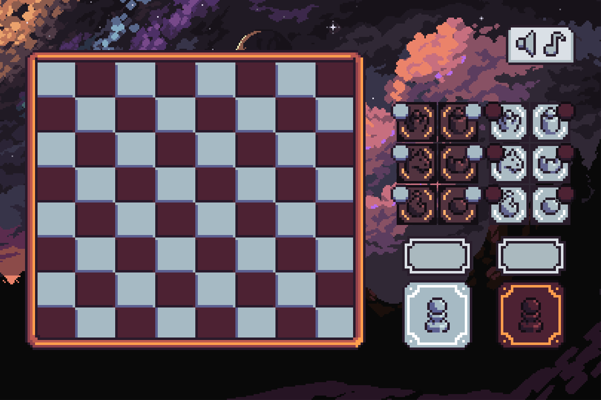

# Layout y add-ons

## Recursos

Teniendo en cuenta los elementos que nos brinda el paquete de java.Swing, crearemos el layout correspondiente con los elementos gráficos de los cuales disponemos. Para ello, creamos una interfaz gráfica por default que el usuario encontrara siempre que ejecute el programa.

<figure><figcaption></figcaption></figure>

### Proceso

<figure><figcaption>
Desarrollo del layout
</figcaption></figure>

A partir de medidas específicas y por medio de aplicaciones para el manejo de imágenes como Photoshop e Illustrator, proponemos una vista previa del juego como tal, organizada por paneles para que se implementen de igual forma en el ejecutable de Java. Con ayuda de los paneles, añadiremos unos dentro de otros, logrando formar el formato deseado. Hay que tener en cuenta, sin embargo, que esto solo es una imagen, y para que el usuario pueda interactuar con los supuestos botones que ve, se generara una capa superior que no tendrá visibilidad con la cual es usuario podrá interactuar siempre que de clic a un supuesto botón.

<figure><figcaption>
Medidas en píxeles de la ventana predeterminada para la ejecución del juego (1200 x 800)
</figcaption></figure>



<figure><figcaption>
Tablero sin notación y sin contadores
</figcaption></figure>



<figure><figcaption>
Tablero sin notación y con contadores
</figcaption></figure>



<figure><figcaption>
Tablero con notación y sin contadores
</figcaption></figure>



<figure><figcaption>
Tablero con notación y contadores
</figcaption></figure>




Los puntos que sobresalen alrededor de las piezas del jugador 1 y jugador 2, hacen de contadores para la cantidad de piezas que cada jugador haya capturado, por ende, si el jugador 1 ha capturado 3 peones, el pequeño círculo que sobresale para en la imagen de los peones negros será el número 3. Cabe recalcar que los contadores varían por pieza y el rey no está incluido.


## Cambios


Se tenía, como idea, darle la oportunidad al usuario de intercambiar visualmente los tableros, pero surgió un problema ante ello y es que esto modificaba por completo la visualización de nuestro programa, obligándonos a fabricar una interfaz gráfica nueva que podía resultar en algo poco eficiente.



Sin embargo, hay adicionales que buscamos implementar como los botones superiores que permitirán al usuario en dado caso reproducir música de fondo o eliminar los efectos de sonido, así mismo, devolverlos.



Hay contenido gratuito al que podemos acceder para ambientar un poco más el juego, siguiendo un estilo retro por el diseño pixel art. En dado caso de poder implementarlo; usaremos algunas de las canciones aquí presentes. Igualmente, el jugador tiene la opción de desactivarla, así como los efectos de sonido de las piezas y demás elementos.

