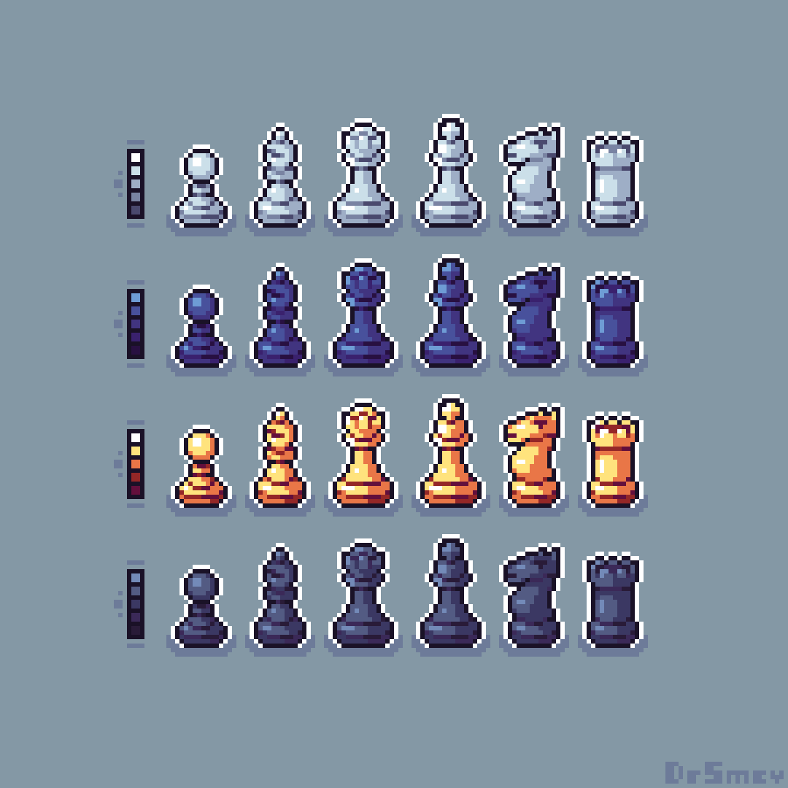

# 💡 Ideas previas

> He estado pensando en algunas cosas para el diseño del juego. Me gusta el estilo de pixel art., y mi compañero está de acuerdo en adoptar un estilo como este. La verdad es que podemos aprovecharlo y darle una ambientación no tan plana al juego, para que no sea un simple ajedrez. Quiero ver más allá de las posibilidades.

## 1. “Press Start”


Logo introductorio que muestre el inicio de sesión del juego, el mítico botón de “start” y que tenga clara relación con cosas de la universidad. El ejemplo que usé para esta idea es de un programa que trataré de conseguir (porque es de pago) que es ideal y quizá el mejor para realizar este tipo de ilustraciones.





<figure><figcaption>
Diseño de inicio de la aplicación
</figcaption></figure>




Trailer de la aplicación




## 2. Las piezas


Las fichas, por supuesto, tienen que seguir la temática del pixel art. Buscaré algunos recursos que sean de mi agrado, tanto para mi compañero como para el diseño. Deben ser sutiles, pero con buenos detalles, algo pulido y que se entienda.




<figure><figcaption>
<a href="https://www.reddit.com/r/PixelArt/comments/pmfegd/sets_of_chess_pieces/">https://www.reddit.com/r/PixelArt/comments/pmfegd/sets_of_chess_pieces/</a>
</figcaption></figure>



<figure><figcaption></figcaption></figure>



<figure><figcaption></figcaption></figure>



## 3. El Layout


Este concepto es el que se ve más simple, pero tal vez sea uno de los más complejos. Hablo de una pequeña interfaz de usuario que aún está en veremos para ver si se implementa o no, y que deposita cierta información relevante sobre el juego y el jugador actual. Está de más decir que el juego es jugador vs. jugador, ya que por ahora no creo que tengamos la capacidad para diseñar un bot que pueda jugar contra alguien.




<figure><figcaption></figcaption></figure>



<figure><figcaption></figcaption></figure>



## 4. Adicionales


Mi última idea para hacer un poco más dinámico el concepto de que no solo sea un ajedrez es encontrar animaciones, si es posible, para cuando el jugador 1 o 2 ganen la partida, siguiendo de nuevo el estilo de pixel art. Me quiero basar un poco en la idea de un juego que había visto por ahí (también de un ajedrez) y tenía una dinámica bastante común. Igualmente, no quiero salirme mucho de lo que es la línea de un ajedrez real, pero sería divertido o más especial añadir alguna mecánica final cuando el juego acabe.





Seguir la lógica de algún tipo de animación similar a la de este juego sería interesante



No siendo tan graficos como lo es el trailer de este juego me parece una idea interesante añadir al final de cada partida algún tipo de animacion de victoria o derrota, también con el estilo pixel art. De alguna forma crear una interacción con el usuario y algo que sea agradable como una idea que me dieron como que por ejemplo algún tipo de frames por segundo que muestren la corona del rey perdedor cayendose y el otro rey disfrutando de su victoria. Son conceptos interesantes que tengo que explorar mas.




<figure><figcaption></figcaption></figure>






